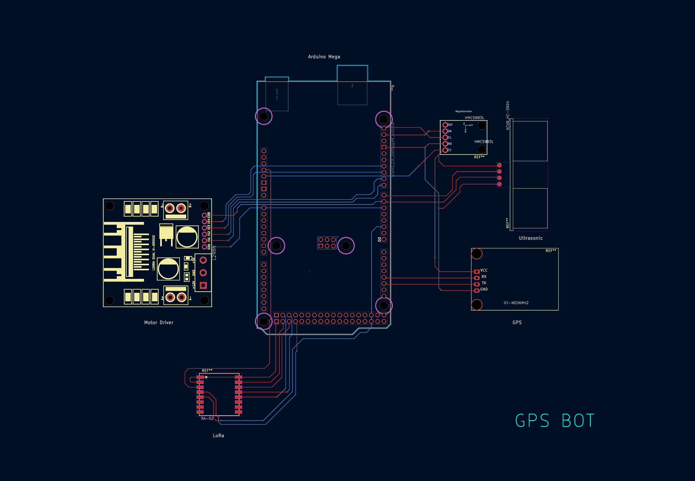

# System Architecture

## Overview

This navigation system implements a **modular, event-driven architecture** designed for real-time sensor fusion, reliable communication, and efficient resource utilization on Arduino Mega 2560 hardware.

## Architectural Principles

### Modular Design

**Core Philosophy:**
- **Separation of concerns**: Each module handles specific functionality
- **High cohesion**: Related functionality grouped together
- **Reusability**: Modules can be easily replaced or extended

**Module Structure:**
```
arduino.ino (Main Controller)
├── gps.cpp/.h (GPS Module)
├── compass.cpp/.h (Compass Module)
├── ultrasonic.cpp/.h (Ultrasonic Module)
├── lora_comm.cpp/.h (LoRa Communication)
├── constants.h (System Constants)
└── pins.h (Hardware Configuration)
```

### Event-Driven Architecture

**Main Loop Structure:**
```cpp
void loop() {
    // GPS Event Processing
    while(ss.available() > 0) {
        if (gps.encode(ss.read())) {
            processGPSEvent();
        }
    }
    
    // Obstacle Detection Event
    if (obstacleDetected()) {
        processObstacleEvent();
    }
}
```

**Benefits:**
- **Responsiveness**: Immediate reaction to sensor events
- **Efficiency**: Only processes when data available
- **Scalability**: Easy to add new event types
- **Non-blocking**: Continuous operation without delays

## Hardware Architecture

### Arduino Mega 2560 Selection

**Why Mega 2560:**
- **Multiple UARTs**: Hardware serial for GPS (Serial1)
- **Abundant I/O**: 54 digital pins, 16 analog inputs
- **Processing power**: 16MHz ATmega2560
- **SPI/I2C**: Hardware support for multiple protocols

### Pin Allocation Strategy

```cpp
// Serial Communications
#define GPS_SERIAL Serial1    // Hardware UART (pins 18,19)
// I2C Bus (compass)         // Hardware I2C (pins 20,21)
// SPI Bus (LoRa)           // Hardware SPI (pins 50,51,52,53)

// Digital I/O
#define TRIG_PIN 40          // Ultrasonic trigger
#define ECHO_PIN 41          // Ultrasonic echo
#define LoRa_RST 49          // LoRa reset
#define LoRa_DIO0 2          // LoRa interrupt
```

**Allocation Principles:**
- **Hardware peripherals**: Use dedicated pins for SPI/I2C/UART
- **Interrupt capable**: Use interrupt pins for time-critical signals
- **Grouping**: Related pins placed together for easier wiring
- **Future expansion**: Reserve pins for additional sensors

### Circuit Wiring Diagram


### Power Management

**Power Distribution:**
```
Arduino Mega
            → GPS Module
            → Ultrasonic Sensor
            → Compass Module
                        
3.3V Regulator → LoRa Module
               → Compass Module (Alternative)
```

**Power Consumption:**
- **Arduino Mega**: ~50mA
- **GPS Module**: ~45mA
- **LoRa Module**: ~120mA (transmitting)
- **Compass**: ~1mA
- **Ultrasonic**: ~15mA (active)
- **Total**: ~230mA peak

### Data Flow Architecture

```
[GPS] → [Compass] → [Message Format] → [Encryption] → [LoRa TX]
  ↓                                                        ↑
[Path Point]                                          [Obstacle]
                                                         ↑
[Ultrasonic] → [Validation] → [Compass] → [Message Format]
```

**Data Transformations:**
1. **Raw sensor data**: Binary sensor readings
2. **Processed data**: Calibrated, filtered values
3. **Structured data**: Formatted strings
4. **Encrypted data**: AES-encrypted bytes
5. **Transmitted data**: LoRa packets

## Module Interfaces

### GPS Module Interface

```cpp
// gps.h - Public Interface
extern TinyGPSPlus gps;
void initGPS();
bool logPathPoint(String& outMsg);

// Internal Implementation
- Hardware Serial1 communication
- TinyGPS++ library for parsing
- Coordinate formatting and validation
```

### Compass Module Interface

```cpp
// compass.h - Public Interface
void initCompass();
int readCompass();

// Internal Implementation
- I2C communication with HMC5883L
- Calibration and normalization
- Multi-sample averaging
- Declination correction
```

### Ultrasonic Module Interface

```cpp
// ultrasonic.h - Public Interface
void initUltrasonic();
float measureDistance();

// Internal Implementation
- Digital I/O for trigger/echo
- Pulse timing measurement
- Distance calculation
- Timeout handling
```

### LoRa Communication Interface

```cpp
// lora_comm.h - Public Interface
void initLoRa();
bool sendMessage(const String& msg);

// Internal Implementation
- SPI communication with LoRa chip
- AES encryption integration
- Packet formatting and transmission
- Error handling and retry logic
```

## Error Handling Strategy

**Error Types:**
1. **Hardware errors**: Sensor initialization failures
2. **Communication errors**: I2C/SPI/UART failures
3. **Data errors**: Invalid sensor readings
4. **Timeout errors**: Sensor response timeouts

**Error Handling Approach:**
```cpp
// Fail-fast initialization
void setup() {
    if (!initLoRa()) {
        Serial.println("LoRa init failed");
        while(true);  // Halt system
    }
    
    if (!initGPS()) {
        Serial.println("GPS init failed");
        while(true);  // Halt system
    }
}

// Runtime error handling
bool logPathPoint(String& outMsg) {
    if (!gps.location.isValid()) {
        return false;  // Skip this reading
    }
    // Continue processing...
}
```

## Scalability Considerations

### Adding New Sensors

**Extension Pattern:**
```cpp
// 1. Create sensor module
sensor_new.h/.cpp

// 2. Add initialization to setup()
void setup() {
    initLoRa();
    initGPS();
    initNewSensor();  // Add here
}

// 3. Add processing to loop()
void loop() {
    // Existing code...
    
    // Add new sensor processing
    if (newSensorDataAvailable()) {
        processNewSensorData();
    }
}
```

### Multi-Robot Support

**Scaling Strategy:**
- **Unique identifiers**: Robot ID in message format
- **Frequency separation**: Different LoRa channels
- **Collision avoidance**: Random backoff algorithms

### Network Expansion

**Network Topologies:**
```
Point-to-Point:
[Robot] → [Base Station]

Star Network:
[Robot1] ↘
[Robot2] → [Base Station]
[Robot3] ↗

Mesh Network:
[Robot1] ↔ [Robot2]
    ↓         ↓
[Robot3] ↔ [Robot4]
```

### Advanced Error Recovery

**Fault Tolerance:**
- **Watchdog timers**: Automatic reset on system hang
- **Redundant sensors**: Backup sensor support
- **Graceful degradation**: Reduced functionality on failures
- **Self-healing**: Automatic error recovery

---

*This architecture provides a solid foundation for a professional navigation system, with careful consideration of hardware limitations, real-time constraints, and future expansion possibilities.*