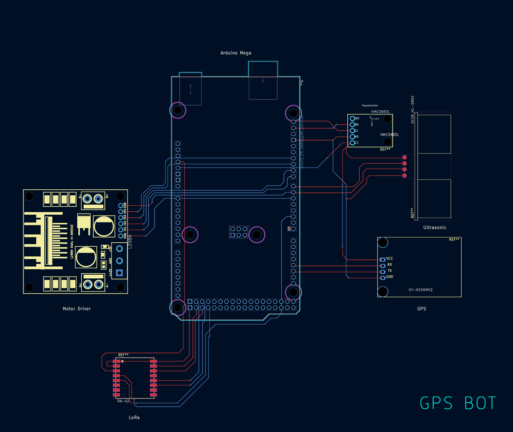

# GPS Bot Mapper System - Complete Documentation

## Table of Contents
1. [System Overview](#system-overview)
2. [Hardware Components](#hardware-components)
3. [Arduino Firmware](#arduino-firmware)
4. [Python Data Processing](#python-data-processing)
5. [Unity Visualization](#unity-visualization)
6. [Installation & Setup](#installation--setup)
7. [Usage Guide](#usage-guide)
8. [API Reference](#api-reference)
9. [Troubleshooting](#troubleshooting)
10. [Contributing](#contributing)

---

## System Overview

The GPS Bot Mapper is a comprehensive autonomous navigation and obstacle detection system designed for mapping and visualization of robot trajectories. The system consists of three main components:

### Architecture
```
┌─────────────────┐    ┌─────────────────┐    ┌─────────────────┐
│   Arduino Bot   │───▶│ Python Scripts  │───▶│ Unity Visualizer│
│   (Hardware)    │    │ (Processing)    │    │ (Visualization) │
└─────────────────┘    └─────────────────┘    └─────────────────┘
```

### Key Features
- **Real-time GPS tracking** with sub-meter accuracy
- **Obstacle detection** using ultrasonic sensors (15-30cm range)
- **Compass-based heading** determination with magnetic declination correction
- **Encrypted LoRa communication** for wireless data transmission
- **Python-based data processing** with UTM coordinate conversion
- **Unity 3D visualization** with real-time path replay
- **Modular design** for easy extension and maintenance

### Data Flow
1. **Arduino sensors** collect GPS, compass, and ultrasonic data
2. **LoRa module** transmits encrypted data packets
3. **Python scripts** log, decrypt, and process the data
4. **CSV files** store processed path and obstacle information
5. **Unity application** visualizes the trajectory and obstacles

---

## Hardware Components

### Required Components
| Component | Model | Purpose | Quantity |
|-----------|-------|---------|----------|
| Microcontroller | Arduino Mega 2560 | Main processing unit | 1 |
| GPS Module | NEO-6M | Position tracking | 1 |
| Compass | HMC5883L | Heading determination | 1 |
| LoRa Module | SX1278 (433MHz) | Wireless communication | 1 |
| Ultrasonic Sensor | HC-SR04 | Obstacle detection | 1 |
| Power Supply | Battery/DC adapter | System power | 1 |

### Pin Configuration (Arduino Mega 2560)
```cpp
// GPS Module
#define GPS_SERIAL Serial1    // RX: Pin 19, TX: Pin 18

// LoRa Module
#define LoRa_SS   53         // Slave Select
#define LoRa_RST  49         // Reset
#define LoRa_DIO0 2          // Digital I/O 0

// Ultrasonic Sensor
#define TRIG_PIN  40         // Trigger
#define ECHO_PIN  41         // Echo

// Compass (I2C)
// SDA: Pin 20, SCL: Pin 21 (default I2C pins)
```

### Circuit Connections
```
Arduino Mega 2560
├── GPS Module (NEO-6M)
│   ├── VCC → 5V
│   ├── GND → GND
│   ├── RX → Pin 18 (TX1)
│   └── TX → Pin 19 (RX1)
├── LoRa Module (SX1278)
│   ├── VCC → 3.3V
│   ├── GND → GND
│   ├── NSS → Pin 53
│   ├── RST → Pin 49
│   ├── DIO0 → Pin 2
│   ├── MOSI → Pin 51
│   ├── MISO → Pin 50
│   └── SCK → Pin 52
├── Ultrasonic Sensor (HC-SR04)
│   ├── VCC → 5V
│   ├── GND → GND
│   ├── Trig → Pin 40
│   └── Echo → Pin 41
└── Compass (HMC5883L)
    ├── VCC → 5V
    ├── GND → GND
    ├── SDA → Pin 20
    └── SCL → Pin 21
```


---

## Arduino Firmware

### Project Structure
```
arduino/
├── arduino.ino          # Main sketch
├── compass.cpp/.h       # Compass sensor interface
├── constants.h          # System constants
├── gps.cpp/.h          # GPS module interface
├── lora_comm.cpp/.h    # LoRa communication
├── pins.h              # Pin definitions
└── ultrasonic.cpp/.h   # Ultrasonic sensor interface
```

### Core Functionality

#### Main Loop (`arduino.ino`)
```cpp
void loop() {
  // GPS Path Logging
  String msg;
  while(ss.available() > 0) {
    if (gps.encode(ss.read())) {
      if (millis() - lastPathSent > PATH_INTERVAL) {
        if (logPathPoint(msg)) {
          msg += "," + String(packetNo++);
          sendMessage(msg);
          lastPathSent = millis();
        }
      }
    }
  }

  // Obstacle Detection
  float distance = measureDistance();
  if ((distance < MAX_OBS_DISTANCE) && (distance > MIN_OBS_DISTANCE)) {
    // Triple measurement for accuracy
    delay(50);
    float second_reading = measureDistance();
    delay(50);
    float third_reading = measureDistance();
    
    if (bothReadingsValid(second_reading, third_reading)) {
      if (millis() - lastObsSent > OBS_INTERVAL) {
        int heading = readCompass();
        String obsMsg = formatObstacleMessage(heading, averageDistance);
        sendMessage(obsMsg);
        lastObsSent = millis();
      }
    }
  }
}
```

#### GPS Module (`gps.cpp`)
- **Initialization**: Configures Serial1 at 9600 baud
- **Data Processing**: Uses TinyGPS++ library for NMEA parsing
- **Validation**: Checks for valid GPS fix before logging
- **Output Format**: `PATH,latitude,longitude,heading,packetNo`

#### Compass Module (`compass.cpp`)
- **Calibration**: Uses pre-calibrated min/max values for X/Y axes
- **Averaging**: Takes 10 samples for stable heading
- **Declination Correction**: Applies local magnetic declination (0.009 rad for Hyderabad)
- **Normalization**: Converts raw magnetometer data to normalized coordinates

#### LoRa Communication (`lora_comm.cpp`)
- **Encryption**: AES-128 encryption for secure data transmission
- **Configuration**: 433MHz frequency, SF12, BW125kHz, CR4/8
- **Error Correction**: CRC enabled for packet integrity
- **Sync Word**: 0x34 for device pairing

#### Ultrasonic Sensor (`ultrasonic.cpp`)
- **Trigger Pulse**: 10μs pulse on trigger pin
- **Echo Measurement**: Times echo pulse duration
- **Distance Calculation**: `distance = (time * sound_speed) / 2`
- **Timeout Handling**: 12ms timeout for no-echo scenarios

### Configuration Constants (`constants.h`)
```cpp
// Physical Constants
constexpr float SOUND_SPEED = 340.1;           // m/s
constexpr unsigned long PULSE_TIMEOUT = 12000; // μs

// Compass Calibration
constexpr float declinationAngle = 0.009;      // radians
constexpr float x_min = -27.64, x_max = 43.36; // magnetometer calibration
constexpr float y_min = -47.82, y_max = 24.36;

// Detection Parameters
constexpr int MIN_OBS_DISTANCE = 15;           // cm
constexpr int MAX_OBS_DISTANCE = 30;           // cm

// Timing Intervals
constexpr unsigned long PATH_INTERVAL = 1000;  // ms
constexpr unsigned long OBS_INTERVAL = 1000;   // ms
```

### Message Formats
- **Path Message**: `PATH,<lat>,<lon>,<heading>,<packetNo>`
- **Obstacle Message**: `OBS,<lat>,<lon>,<heading>,<distance>,<packetNo>`

Example:
```
PATH,12.971642,77.594643,92,001
OBS,12.971650,77.594647,180,25.4,002
```

---

## Python Data Processing

### Project Structure
```
python/
├── scripts/
│   ├── log_serial_data.py     # Real-time data logging
│   ├── log_data_backup.py     # Backup data processing
│   └── plot_map.py            # Data visualization
├── data/
│   ├── path_data.csv          # GPS path points
│   ├── obs_data.csv           # Obstacle detections
│   └── estimated_data.csv     # Processed obstacle positions
├── outputs/
│   ├── trajectory_absolute.png # UTM coordinate plot
│   └── trajectory_relative.png # Relative coordinate plot
└── requirements.txt           # Python dependencies
```

### Data Logging (`log_serial_data.py`)

#### Serial Communication Setup
```python
import serial
import csv

# Configure serial port
ser = serial.Serial('/dev/ttyACM0', 9600, timeout=1)
```

#### Data Parsing Logic
```python
def parse_message(line):
    parts = line.split(',')
    
    if parts[0] == 'PATH' and len(parts) == 5:
        return {
            'type': 'PATH',
            'lat': float(parts[1]),
            'lon': float(parts[2]),
            'heading': float(parts[3]),
            'packet_no': int(parts[4])
        }
    
    elif parts[0] == 'OBS' and len(parts) == 6:
        return {
            'type': 'OBS',
            'lat': float(parts[1]),
            'lon': float(parts[2]),
            'heading': float(parts[3]),
            'distance': float(parts[4]),
            'packet_no': int(parts[5])
        }
```

#### CSV Output Format
**path_data.csv**
```csv
Latitude,Longitude,Heading
12.971642,77.594643,92
12.971645,77.594648,94
```

**obs_data.csv**
```csv
Latitude,Longitude,Heading,Distance
12.971650,77.594647,180,25.4
12.971655,77.594652,175,22.8
```

### Data Visualization (`plot_map.py`)

#### Coordinate Conversion
```python
import utm

def convert_to_utm(lat, lon):
    """Convert GPS coordinates to UTM for accurate distance representation"""
    x, y, zone, letter = utm.from_latlon(lat, lon)
    return x, y
```

#### Obstacle Position Estimation
```python
def estimate_obstacle_position(robot_pos, heading, distance):
    """Estimate obstacle position using robot position, heading, and distance"""
    # Convert heading to mathematical convention (North = 90°)
    math_heading = 90 - heading
    
    # Calculate offset in meters
    dx = (distance / 100) * np.cos(np.radians(math_heading))
    dy = (distance / 100) * np.sin(np.radians(math_heading))
    
    # Add offset to robot position
    obs_x = robot_pos[0] + dx
    obs_y = robot_pos[1] + dy
    
    return obs_x, obs_y
```

#### Visualization Features
- **Path Plotting**: Dashed green line with directional arrows
- **Obstacle Markers**: Red 'X' symbols at estimated positions
- **Heading Indicators**: Quiver plots showing orientation
- **Distance Lines**: Dotted lines from robot to obstacles
- **Coordinate Systems**: Both absolute (UTM) and relative plots

### Dependencies (`requirements.txt`)
```
numpy>=1.21.0
matplotlib>=3.5.0
utm>=0.7.0
pyserial>=3.5
```

---

## Unity Visualization

### Project Structure
```
unity/Assets/
├── Scripts/
│   ├── pathVisualiser.cs    # Main visualization controller
│   └── cameraFollow.cs      # Camera tracking system
├── Resources/
│   ├── path_data.csv        # Path data file
│   └── obs_data.csv         # Obstacle data file
├── Prefabs/
│   ├── BotPrefab            # Robot representation
│   └── HeadingArrowPrefab   # Obstacle direction indicator
└── Scenes/
    └── MainScene.unity      # Main visualization scene
```

### Path Visualizer (`pathVisualiser.cs`)

#### Core Components
```csharp
public class pathVisualiser : MonoBehaviour
{
    [Header("Prefabs")]
    public GameObject botPrefab;
    public GameObject headingArrowPrefab;
    
    [Header("Animation Settings")]
    private float speed = 5f;
    private float scale = 1e5f;  // GPS to Unity coordinate scaling
    
    [Header("Data Storage")]
    private List<Vector2> pathPoints = new List<Vector2>();
    private List<Vector2> obsPoints = new List<Vector2>();
    private List<float> headings = new List<float>();
    private Vector2 referencePoint;  // Origin point for relative coordinates
}
```

#### Data Loading System
```csharp
void loadPathCSV(string fileName)
{
    TextAsset csvData = Resources.Load<TextAsset>(fileName);
    string[] lines = csvData.text.Split('\n');
    
    for (int i = 1; i < lines.Length; i++)  // Skip header
    {
        string[] values = lines[i].Trim().Split(',');
        if (values.Length < 3) continue;
        
        float lat = float.Parse(values[0]);
        float lon = float.Parse(values[1]);
        float heading = float.Parse(values[2]);
        
        // Set reference point from first valid entry
        if (i == 1)
        {
            referencePoint = new Vector2(lon, lat);
        }
        
        // Convert to Unity coordinates
        float x = (lon - referencePoint.x) * scale;
        float y = (lat - referencePoint.y) * scale;
        
        pathPoints.Add(new Vector2(x, y));
        headings.Add(heading);
    }
}
```

#### Animation System
```csharp
IEnumerator MoveBotAlongPath()
{
    while (currentIndex < pathPoints.Count - 1)
    {
        Vector2 start = pathPoints[currentIndex];
        Vector2 end = pathPoints[currentIndex + 1];
        float t = 0;
        
        while (t < 1f)
        {
            // Interpolate position
            Vector2 currentPos = Vector2.Lerp(start, end, t);
            bot.transform.position = currentPos;
            bot.transform.rotation = Quaternion.Euler(0, 0, -headings[currentIndex]);
            
            // Update dynamic trail
            dynamicLine.positionCount++;
            dynamicLine.SetPosition(dynamicLine.positionCount - 1, currentPos);
            
            // Check for nearby obstacles
            RevealNearbyObstacles(currentPos);
            
            t += Time.deltaTime * speed;
            yield return null;
        }
        
        currentIndex++;
    }
}
```

#### Dynamic Trail System
```csharp
void SetupDynamicTrail()
{
    dynamicLine = bot.AddComponent<LineRenderer>();
    dynamicLine.positionCount = 0;
    dynamicLine.startWidth = 0.05f;
    dynamicLine.endWidth = 0.05f;
    dynamicLine.material = new Material(Shader.Find("Sprites/Default"));
    
    // Create gradient from green to cyan
    Gradient gradient = new Gradient();
    gradient.SetKeys(
        new GradientColorKey[] {
            new GradientColorKey(Color.green, 0.0f),
            new GradientColorKey(Color.cyan, 1.0f)
        },
        new GradientAlphaKey[] {
            new GradientAlphaKey(1.0f, 0.0f),
            new GradientAlphaKey(1.0f, 1.0f)
        }
    );
    
    dynamicLine.colorGradient = gradient;
    dynamicLine.numCornerVertices = 5;
    dynamicLine.numCapVertices = 5;
}
```

### Camera Follow System (`cameraFollow.cs`)

#### Smooth Following
```csharp
public class CameraFollow : MonoBehaviour
{
    [Header("Target Settings")]
    public Transform target;
    public Vector3 offset = new Vector3(0, 0, -10);
    public float smoothSpeed = 0.125f;
    
    void LateUpdate()
    {
        if (target == null) return;
        
        Vector3 desiredPosition = target.position + offset;
        Vector3 smoothed = Vector3.Lerp(transform.position, desiredPosition, smoothSpeed);
        transform.position = smoothed;
    }
}
```

### Visualization Features
- **Real-time path replay** with smooth interpolation
- **Dynamic trail rendering** with gradient coloring
- **Obstacle revelation** based on proximity
- **Heading indicators** showing robot orientation
- **Camera following** for immersive experience
- **Coordinate scaling** for Unity world space

---

## Installation & Setup

### Arduino Setup

#### Required Libraries
Install these libraries through Arduino IDE Library Manager:

- [Arduino.h](https://www.arduino.cc/en/Reference/Arduino)
- [Wire.h](https://www.arduino.cc/en/Reference/Wire)
- [Adafruit_Sensor.h](https://github.com/adafruit/Adafruit_Sensor)
- [Adafruit_HMC5883_U.h](https://github.com/adafruit/Adafruit_HMC5883_Unified)
- [TinyGPS++.h](https://github.com/mikalhart/TinyGPSPlus)
- [LoRa.h](https://github.com/sandeepmistry/arduino-LoRa)
- [Crypto.h](https://rweather.github.io/arduinolibs/crypto.html)
- [AES.h](https://rweather.github.io/arduinolibs/aes.html)
- [SPI.h](https://www.arduino.cc/en/Reference/SPI)


#### Hardware Assembly
1. **Mount components** on Arduino Mega 2560
2. **Connect wires** according to pin configuration
3. **Test connections**
4. **Upload firmware** using Arduino IDE

#### Calibration Process
1. **Compass Calibration**:
   ```cpp
   // Rotate device 360 degrees
   // Record min/max values for X/Y axes
   constexpr float x_min = -27.64, x_max = 43.36;
   constexpr float y_min = -47.82, y_max = 24.36;
   ```

2. **GPS Validation**:
   ```cpp
   // Wait for GPS fix (LED indicator recommended)
   if (gps.location.isValid()) {
       Serial.println("GPS Ready");
   }
   ```

### Python Setup

#### Environment Setup
```bash
# Create virtual environment
python -m venv gps_mapper_env
source gps_mapper_env/bin/activate  # Linux/Mac
gps_mapper_env\Scripts\activate     # Windows

# Install dependencies
pip install -r requirements.txt
```

#### Serial Port Configuration
```python
# Linux/Mac
ser = serial.Serial('/dev/ttyACM0', 9600, timeout=1)

# Windows
ser = serial.Serial('COM3', 9600, timeout=1)
```

### Unity Setup

#### Project Configuration
1. **Create new Unity project** (2D template recommended)
2. **Import CSV files** into Resources folder
3. **Create prefabs** for bot and obstacle arrows
4. **Set up scene** with camera and visualization objects

#### CSV File Format
Place CSV files in `Assets/Resources/`:
- `path_data.csv` - GPS path points
- `obs_data.csv` - Obstacle detections

---

## Usage Guide

### 1. Data Collection
```bash
# Start Arduino system
# Open serial monitor to verify operation, and close
# Run Python logging script
python scripts/log_serial_data.py

# Data will be saved to:
# - path_data.csv (GPS path)
# - obs_data.csv (obstacle detections)
# - backup.txt (raw data backup)
```

### 2. Data Processing
```bash
# Generate visualization plots
python scripts/plot_map.py

# Output files:
# - trajectory_absolute.png (UTM coordinates)
# - trajectory_relative.png (relative coordinates)
# - estimated_data.csv (processed obstacle positions)
```

### 3. Unity Visualization
1. **Open Unity project**
2. **Update CSV files** in Resources folder
3. **Run scene** to start visualization
4. **Observe real-time replay** of robot trajectory

### Operational Workflow
```
Data Collection → Processing → Visualization
      ↓               ↓            ↓
   Arduino        Python       Unity
   Hardware       Scripts    Application
```

---

## API Reference

### Arduino Functions

#### GPS Module
```cpp
void initGPS()
// Initializes GPS module on Serial1

bool logPathPoint(String& outMsg)
// Creates path message string
// Returns: false if GPS invalid, true otherwise
```

#### Compass Module
```cpp
void initCompass()
// Initializes HMC5883 compass sensor

int readCompass()
// Returns: Heading in degrees (0-359)
// Averages 10 samples for stability
```

#### LoRa Communication
```cpp
void initLoRa()
// Initializes LoRa module with encryption

bool sendMessage(const String& msg)
// Encrypts and sends message via LoRa
// Returns: true if sent successfully
```

#### Ultrasonic Sensor
```cpp
void initUltrasonic()
// Initializes ultrasonic sensor pins

float measureDistance()
// Returns: Distance in centimeters
// Returns 999 if no echo received
```

### Python Functions

#### Data Logging
```python
def parse_message(line):
    """Parse incoming serial message"""
    # Returns dictionary with parsed data

def save_to_csv(data, filename):
    """Save data list to CSV file"""
    # Handles CSV writing with headers
```

#### Visualization
```python
def convert_to_utm(lat, lon):
    """Convert GPS to UTM coordinates"""
    # Returns (easting, northing) in meters

def estimate_obstacle_position(robot_pos, heading, distance):
    """Calculate obstacle position"""
    # Returns (x, y) coordinates of obstacle
```

### Unity Components

#### PathVisualizer
```csharp
public void LoadPathCSV(string fileName)
// Loads path data from Resources folder

public void LoadObsCSV(string fileName)
// Loads obstacle data from Resources folder

public IEnumerator MoveBotAlongPath()
// Animates bot movement along recorded path
```

#### CameraFollow
```csharp
public void SetTarget(Transform target)
// Sets camera follow target

public void UpdateOffset(Vector3 newOffset)
// Updates camera offset from target
```

---

## Troubleshooting

### Common Issues & Solutions

#### Arduino Issues

**GPS Not Getting Fix**
```
Problem: GPS module not acquiring satellite lock
Solution: 
1. Check antenna connection
2. Test outdoors with clear sky view
3. Verify GPS module power (3.3V/5V)
4. Check Serial1 connections (pins 18/19)
```

**Compass Readings Incorrect**
```
Problem: Heading values inconsistent or wrong
Solution:
1. Recalibrate compass using figure-8 motion
2. Check for magnetic interference
3. Verify I2C connections (pins 20/21)
4. Update declination angle for location
```

**LoRa Communication Failed**
```
Problem: No data transmission via LoRa
Solution:
1. Check LoRa module power (3.3V)
2. Verify SPI connections (pins 50-53)
3. Ensure matching frequency (433MHz)
4. Test with simple transmission code
```

#### Python Issues

**Serial Port Error**
```
Problem: Cannot open serial port
Solution:
1. Check port name (/dev/ttyACM0 vs COM3)
2. Verify permissions: sudo chmod 666 /dev/ttyACM0
3. Close other applications using port
4. Try different USB cable/port
```

**CSV Parsing Error**
```
Problem: Invalid data in CSV files
Solution:
1. Check for incomplete lines in backup.txt
2. Verify message format matches expected pattern
3. Handle empty lines and malformed data
4. Validate GPS coordinates (not zero)
```

#### Unity Issues

**CSV File Not Found**
```
Problem: Cannot load CSV files in Unity
Solution:
1. Place files in Assets/Resources/ folder
2. Use filename without extension in LoadCSV()
3. Check file format (Unix vs Windows line endings)
4. Verify CSV header matches expected format
```

**Animation Not Working**
```
Problem: Bot not moving along path
Solution:
1. Check pathPoints list has valid data
2. Verify coordinate scaling (scale = 1e5f)
3. Ensure bot prefab is instantiated
4. Check camera follow script is attached
```

### Debug Techniques

#### Arduino Debugging
```cpp
// Enable detailed logging
#define DEBUG_MODE 1

#if DEBUG_MODE
    Serial.print("GPS Fix: ");
    Serial.println(gps.location.isValid());
    Serial.print("Satellites: ");
    Serial.println(gps.satellites.value());
#endif
```

#### Python Debugging
```python
# Add verbose logging
import logging
logging.basicConfig(level=logging.DEBUG)

# Validate data before processing
def validate_gps_data(lat, lon):
    if abs(lat) < 1e-6 and abs(lon) < 1e-6:
        print(f"Warning: Invalid GPS coordinates: {lat}, {lon}")
        return False
    return True
```

#### Unity Debugging
```csharp
// Enable debug visualization
void OnDrawGizmos()
{
    // Draw path points
    Gizmos.color = Color.green;
    for (int i = 0; i < pathPoints.Count; i++)
    {
        Gizmos.DrawSphere(pathPoints[i], 0.1f);
    }
    
    // Draw obstacle points
    Gizmos.color = Color.red;
    for (int i = 0; i < obsPoints.Count; i++)
    {
        Gizmos.DrawSphere(obsPoints[i], 0.05f);
    }
}
```

---

## File Organization
```
project/
├── arduino/          # Firmware code
├── python/           # Data processing scripts
├── unity/            # Visualization project
├── docs/             # Documentation
├── tests/            # Unit tests
└── examples/         # Usage examples
```

---

### Technologies Used
- **Arduino**: Open-source hardware platform
- **Python**: Data processing and visualization
- **Unity**: 3D visualization and animation
- **LoRa**: Long-range wireless communication
- **GPS**: Global positioning system
